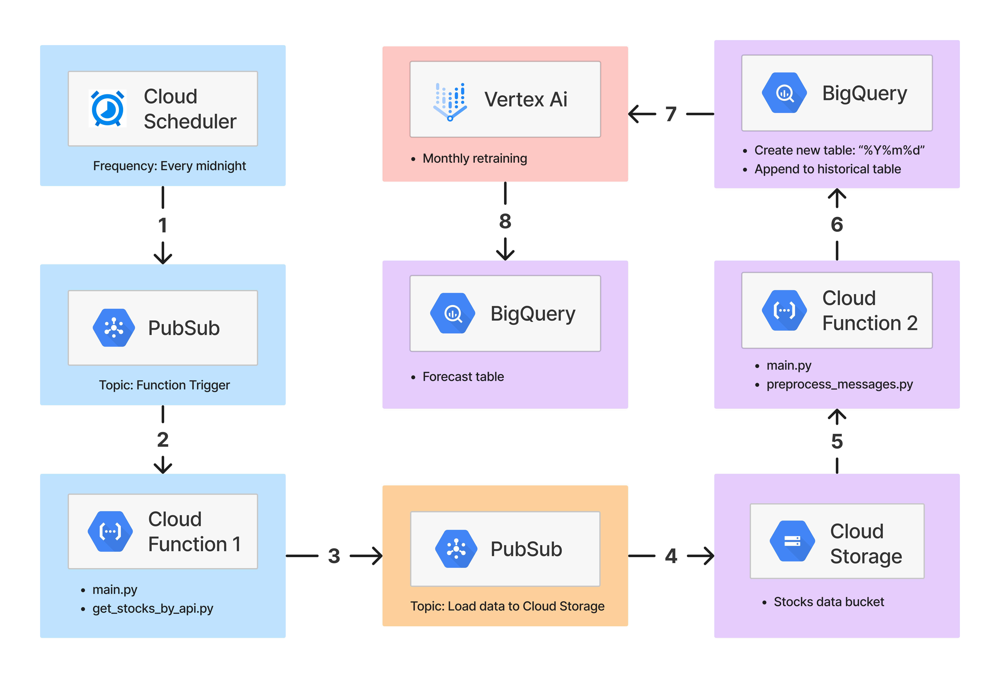

# Stocks Data ETL & Forecast Pipeline on Google Cloud Platform
## Overview
This project sets up an end-to-end data pipeline to extract, load, and transform stocks data for MAANG companies (Meta, Amazon, Apple, Netflix, Google), as well as forecast the weighted volume average stock price in the Google Cloud Platform infrastructure. The pipeline consists of fetching data from Polygon.io API with Cloud Function, publishing it to Pub/Sub, storing it in Cloud Storage, transforming and loading it into BigQuery table. The final stage of the pipeline is the forecast with ARIMA model using Vertex Ai and uploading forecasted data to BigQuery.

## Components
### Cloud Function 1:
- get_stocks_api.py: A script fetching stocks data for MAANG companies in JSON format using Polygon.io API.
- main.py: A script publishing the JSON data into a Pub/Sub topic.

### Cloud Function 2:
- preprocess_messages.py: A script to tranform data from Cloud Storage into dataframe with defined schema.
- main.py: A script responsible for uploading preprocessed data into a new and historical BigQuery tables.

### PubSub Topic: stocks-function-trigger
A PubSub Topic that triggers Cloud Function 1.

### PubSub Topic: stocks-data
A PubSub Topic that accepts JSON messages from Cloud Function 1.

### Cloud Scheduler:
Responsible for sending a message into PubSub topic "stocks-function-trigger" every midnight.

### Cloud Storage: stocks-historical-data
Cloud Storage bucket that stores all data passed from PubSub topic "stocks-data".

### VertexAi Notebook
Jupyter Notebook to train ARIMA model, forecast weighted volume average price for each stock, and upload forecasted data to the corresponding BigQuery table.

### BigQuery
Data warehouse to store data for each day in separate tables.  

